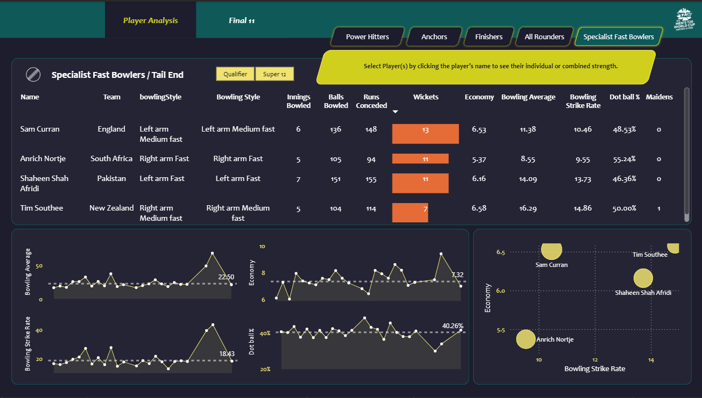
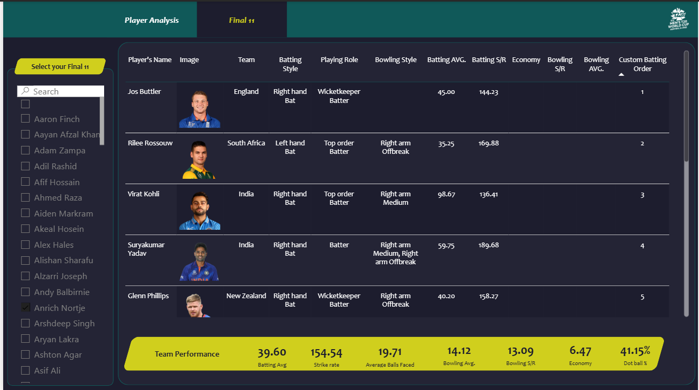

# T20 World Cup 2022: Cricket Data Analytics

## 📸 Screenshots 

 

---

## 🎯 Project Objective
Analyze T20 World Cup 2022 data and build a **Power BI dashboard** to identify the best playing XI based on real player performance statistics.  

The project follows a real-world sports analytics workflow: selecting a balanced team that can score ~180 runs and defend ~150 runs successfully using data-driven insights.

---

## 🧠 Workflow Overview

1. **Data Collection**
   - Scraped match data from **ESPN Cricinfo** using Bright Data.
   - Collected JSON files: batting, bowling, match results, and player info.

2. **Data Cleaning & Transformation (Python)**
   - Normalized nested JSON into Pandas DataFrames.
   - Cleaned inconsistent player names, missing values, and formatting issues.
   - Derived key metrics: Batting Average, Strike Rate, Boundary %, Bowling Economy, Wickets per Match, etc.
   - Exported cleaned CSVs for Power BI.

3. **Data Modeling (Power BI)**
   - Imported CSVs into Power BI and created a **star schema**:
     - `dim_players`, `fact_batting_summary`, `fact_bowling_summary`, `dim_match_summary`
   - Ensured data quality and relationships.

4. **Measures & DAX Logic**
   - Created DAX measures for batting and bowling performance.
   - Conditional logic to categorize players by role (opener, anchor, all-rounder, bowler).

5. **Dashboard Design**
   - Interactive visuals with filtering by team, player type, and role.
   - Comparison charts: Strike Rate vs Average, Economy vs Wickets, Boundary % contribution.
   - Final dashboard recommends the **optimal 11-player lineup**.

---

## 💡 Insights & Learnings
- End-to-end analytics from raw JSON to actionable dashboard.
- Hands-on experience with:
  - **Python (Pandas, NumPy)** for data wrangling
  - **Power BI** for data modeling and visualization
  - **DAX** for performance metrics
  - Data storytelling and interactive dashboard design.

---

## 🧰 Tech Stack

| Layer            | Tools / Skills Used |
|-----------------|------------------|
| Data Collection  | Bright Data (Web Scraper) |
| Processing       | Python (Pandas, NumPy) |
| Visualization    | Power BI |
| Data Modeling    | Star Schema Design |
| DAX Measures     | IF, SWITCH, CALCULATE, DIVIDE, SELECTEDVALUE |
| Others           | Problem Solving, Domain Analysis, Data Storytelling |

---
made by Devansh Dobhal
devanshdobhal983@gmail.com
